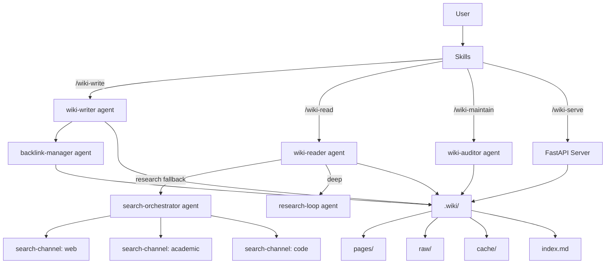

<p align="center">
  
  
  
  
</p>

# llm-wiki

**Your autonomous second brain for Claude Code.**

LLM-powered personal wiki that grows as you work. Research is automatically saved, questions are answered from existing knowledge first, and everything is interlinked. Built on [Andrej Karpathy's LLM Wiki pattern](https://gist.github.com/karpathy/442a6bf555914893e9891c11519de94f): raw sources are immutable, the LLM maintains the wiki layer, and a schema governs behavior.

---

## Why llm-wiki?

Most knowledge tools require you to manually organize information. llm-wiki is different:

- **Zero friction** — knowledge is captured automatically as you work
- **Wiki-first answers** — Claude checks your wiki before searching the web
- **Research-on-miss** — if the wiki doesn't have the answer, it researches and saves it
- **Tool-agnostic** — works with whatever search/research tools you have (WebSearch, Perplexity MCP, Exa, etc.)
- **Self-maintaining** — lints broken links, merges duplicates, flags stale content
- **Compounding returns** — the more you use it, the smarter it gets

---

## Features

### Knowledge Management
- **Automatic capture** — saves research, ideas, decisions, and findings as you work
- **Smart retrieval** — checks the wiki before web search, grounds answers in existing knowledge
- **Hybrid search** — BM25 keyword matching + semantic vector similarity via Reciprocal Rank Fusion
- **Block references** — `[[page#heading]]` links and `![[page#section]]` transclusion
- **Backlinks** — automatic reverse-link tracking with unlinked mention detection
- **Frontmatter queries** — Dataview-like query language to search your wiki like a database
- **Research fallback** — `/wiki-read` automatically researches using available tools when the wiki lacks coverage

### Research Engine
- **Tool-agnostic research** — uses whatever tools are available (WebSearch, WebFetch, any MCP tools)
- **Multi-channel search** — web, academic (Semantic Scholar, OpenAlex, arXiv), code (GitHub, npm, PyPI)
- **Citation snowballing** — forward/backward citation graph from seed papers
- **Autonomous research loops** — iterative hypothesis-driven research with git-based rollback
- **Provenance tracking** — W3C PROV-inspired source attribution for every fact
- **Fact-checking pipeline** — extract claims, verify against external sources
- **Credibility scoring** — tiered source ranking

### Intelligent Freshness
Content ages differently. llm-wiki uses a 9-tier freshness system:

| Tier | TTL | Examples |
|------|-----|---------|
| live | 15 min | stock prices, server status, deployment state |
| breaking | 1-6 hours | breaking news, incident updates |
| current | 1-3 days | news articles, trending topics |
| fast | 1-4 weeks | AI/LLM/MCP, API changes, benchmarks |
| moderate | 1-3 months | software versions, frameworks |
| standard | 6 months | general knowledge (default) |
| academic | 1 year | research papers, studies |
| evergreen | 5 years | history, foundational concepts |
| permanent | never | personal notes, ideas, memories |

Override per-page with `freshness_tier:` or `ttl:` in frontmatter (e.g. `ttl: 30m`).

### Web UI
- **Wikipedia-style** browsable website with 4 themes (light, dark, terminal, wikipedia)
- **Interactive knowledge graph** — Cytoscape.js with clustering, layouts, neighborhood highlighting
- **Canvas view** — spatial whiteboard for arranging and connecting pages
- **Split-pane editor** — markdown + live preview with AI assist toolbar
- **Live research** — click any red link to auto-research the topic
- **Spaced repetition** — FSRS-based review scheduling for active recall
- **Gap analysis dashboard** — find missing knowledge and structural holes
- **Chat sidebar** — RAG-augmented Q&A grounded in your wiki

### Self-Maintenance
- **Link linting** — finds and reports broken `[[wiki-links]]`
- **Duplicate merging** — detects near-duplicate pages (>60% slug overlap)
- **Confidence upgrades** — auto-upgrades pages with 3+ corroborating sources
- **Stale detection** — flags content past its freshness tier threshold
- **Concept synthesis** — suggests bridging articles for related page clusters
- **Progressive summarization** — note maturity tracking (seed/growing/mature/evergreen)
- **Git integration** — auto-commit, attribution, rollback

---

## Quick Start

### Install

```bash
# Clone into your Claude Code plugins directory
git clone https://github.com/Oshayr/llm-wiki .claude/plugins/llm-wiki

# Install dependencies
pip install -r .claude/plugins/llm-wiki/requirements.txt
```

Restart Claude Code. The wiki auto-creates on first use.

### Optional: Semantic Search

```bash
pip install onnxruntime tokenizers numpy sqlite-vec
```

Embedding model (~23MB ONNX) downloads automatically. No PyTorch required.

### First Use

```
> /wiki-write https://example.com/interesting-article
  # Fetches, extracts, creates wiki pages — fully autonomous

> /wiki-read What do we know about X?
  # Searches wiki first, researches if needed, saves results

> /wiki-serve
  # Opens Wikipedia-style UI at localhost:8420
```

---

## Skills

| Command | Purpose |
|---------|---------|
| `/wiki-write <source>` | Ingest content from URL, file, or text. Auto-creates `.wiki/` on first use. |
| `/wiki-read <question>` | Search wiki for cited answers. Auto-researches if wiki lacks coverage. |
| `/wiki-serve` | Start Wikipedia-style web UI on localhost:8420. |
| `/wiki-maintain` | Lint links, merge duplicates, upgrade confidence, detect stale content. |
| `/wiki-view` | Dashboard, knowledge graph, stats, export (HTML/MD/JSON). |

### /wiki-write

```
/wiki-write <url>                  # Ingest a web page
/wiki-write <file-path>            # Ingest a local file
/wiki-write "text..."              # Ingest pasted text
/wiki-write --batch <dir>          # Ingest all .md files in directory
/wiki-write --update <slug>        # Update an existing page
/wiki-write --refresh-stale        # Refresh pages past their freshness tier
```

### /wiki-read

```
/wiki-read <question>              # Standard: wiki search + research fallback
/wiki-read quick <question>        # Index scan only (fastest, no research)
/wiki-read deep <question>         # Full search + raw sources + multi-round research
```

### /wiki-view

```
/wiki-view                         # Dashboard summary
/wiki-view pages                   # List all pages by type
/wiki-view stats                   # Detailed statistics
/wiki-view graph                   # Knowledge graph (Mermaid)
/wiki-view graph <slug>            # 2-hop neighborhood graph
/wiki-view export html|md|json     # Export entire wiki
/wiki-view artifacts <type>        # Generate study guide, timeline, glossary, comparison
```

---

## Architecture



```
llm-wiki/
  .claude-plugin/       Plugin metadata (plugin.json, marketplace.json)
  agents/               10 autonomous agents
  bin/                  22 CLI utilities (search, embed, backlinks, gaps, cache, ...)
  mcp/                  MCP server for wiki operations
  rules/                Workflow and integration rules
  skills/               5 user-facing skills
    serve/
      scripts/          FastAPI server, WikiStore, RAG, chat, research workers
      static/           JavaScript + CSS (4 themes)
      templates/        16 Jinja2 templates
```

---

## Data Model

Wiki data lives in `.wiki/` — location follows plugin install scope:
- **User-level install** (`~/.claude/plugins/llm-wiki`) → `~/.wiki/`
- **Project-level install** (`.claude/plugins/llm-wiki`) → project root

```
.wiki/
  pages/          Markdown files with YAML frontmatter (source of truth)
  index.md        Auto-generated page catalog
  log.md          Append-only activity log
  overview.md     Current understanding synthesis
  SCHEMA.md       Evaluation rules and conventions
  cache/          SQLite databases (search, vectors, backlinks, flashcards, provenance)
  raw/            Immutable source materials
    web/ papers/ notes/ transcripts/ code/ feeds/ assets/
```

### Page Frontmatter

```yaml
---
title: Machine Learning Basics
type: concept                    # concept, entity, source, idea, status, rules, memory, reference
confidence: medium               # high (3+ sources), medium (2+), low (1 source)
sources: [ml-textbook, andrew-ng-course]
related: [deep-learning, neural-networks]
tags: [ml, ai, fundamentals]
freshness_tier: academic         # optional: live, breaking, current, fast, moderate, standard, academic, evergreen, permanent
ttl: 365d                        # optional: custom TTL override
created: 2025-01-15
updated: 2025-03-20
---
```

### Page Types

| Type | Purpose |
|------|---------|
| concept | Standard knowledge article |
| entity | Person, organization, product, tool |
| source | Summary of a source document |
| idea | Single idea with evaluation |
| brainstorming | Freeform ideas with themes |
| status | Dashboard with metrics and action items |
| rules | Numbered policies with exceptions |
| config | Key-value settings |
| memory | Persistent facts and relationships |
| reference | Pointers to external resources |

---

## Agents

| Agent | Model | Role |
|-------|-------|------|
| wiki-writer | sonnet | Create and update wiki pages autonomously |
| wiki-reader | haiku | Search wiki, synthesize answers, research fallback |
| wiki-auditor | haiku | Lint links, fix frontmatter, detect duplicates |
| backlink-manager | haiku | Maintain reverse-link index and related fields |
| search-orchestrator | sonnet | Multi-channel parallel search coordination |
| search-channel | haiku | Execute search on a single channel |
| research-loop | sonnet | Iterative research with git-based rollback |
| research-processor | haiku | Deduplicate and condense research findings |
| fact-checker | sonnet | Verify claims against external sources |
| citation-explorer | sonnet | Academic citation graph snowballing |

---

## MCP Server

The plugin includes an MCP server (`mcp/wiki-mcp-server.py`) exposing wiki operations as tools:

| Tool | Description |
|------|-------------|
| `wiki_search` | Hybrid semantic + keyword search |
| `wiki_read` | Read a page by slug |
| `wiki_write` | Create or update a page |
| `wiki_list` | List pages, filter by type |
| `wiki_backlinks` | Get backlinks and unlinked mentions |
| `wiki_stats` | Page count, types, confidence distribution |
| `wiki_query` | Dataview-style frontmatter queries |
| `wiki_gaps` | Content gap analysis |
| `wiki_daily` | Create or get today's daily note |

Resources: `wiki://index`, `wiki://pages/{slug}`

---

## Compatibility

- **Obsidian** — open `.wiki/` as a vault for graph visualization and editing
- **Any MCP tools** — research fallback uses whatever search/fetch MCPs are available
- **Git** — auto-commit with attribution, rollback support
- **PDF/Word/text** — ingest any readable file format

---

## How It Works

1. **You work normally** — Claude saves relevant knowledge to the wiki automatically
2. **Wiki grows** — research, ideas, decisions, and patterns accumulate as interlinked pages
3. **Wiki serves you** — Claude checks the wiki first when you ask questions, citing sources
4. **Wiki maintains itself** — periodic lint, dedup, confidence upgrades, stale detection
5. **Knowledge compounds** — the more you use it, the richer and more useful it becomes

---

## Credits

- [Andrej Karpathy's LLM Wiki pattern](https://gist.github.com/karpathy/442a6bf555914893e9891c11519de94f) — the foundational idea
- [FSRS](https://github.com/open-spaced-repetition/fsrs4anki) — spaced repetition scheduling algorithm
- [Cytoscape.js](https://js.cytoscape.org/) — knowledge graph visualization
- [Semantic Scholar API](https://api.semanticscholar.org/) — academic paper search
- [Reciprocal Rank Fusion](https://plg.uwaterloo.ca/~gvcormac/cormacksigir09-rrf.pdf) — hybrid search ranking

## License

MIT
