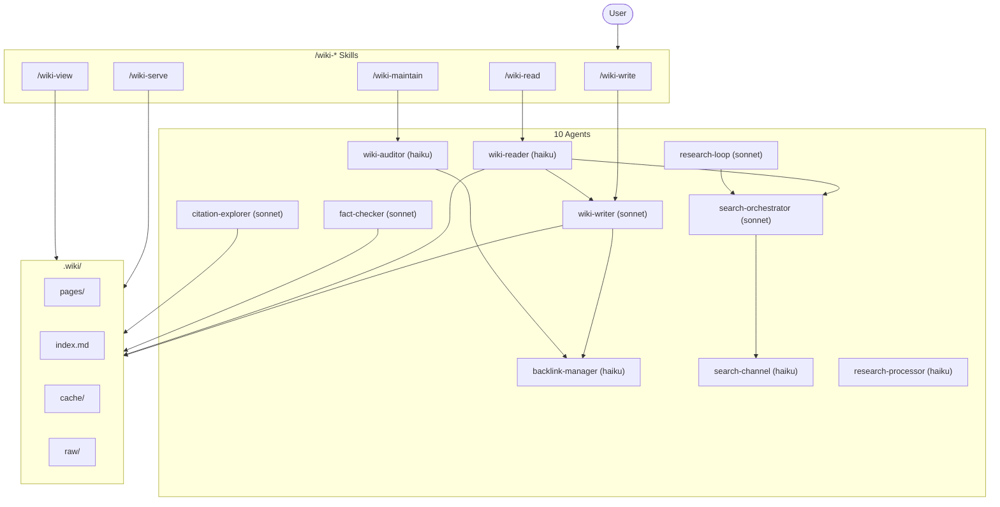

# llm-wiki

[](https://opensource.org/licenses/MIT)
[](https://github.com/Oshayr/llm-wiki)
[](https://claude.ai/claude-code)
[](https://github.com/Oshayr/llm-wiki/pulls)

**An autonomous knowledge base that grows as you work.** LLM Wiki is a [Claude Code](https://claude.ai/claude-code) plugin that captures research, ideas, and decisions into an interlinked wiki with semantic search, automatic research, and a Wikipedia-style web UI. Knowledge compounds over time — the more you use it, the smarter it gets.

Inspired by [Andrej Karpathy's LLM Wiki pattern](https://gist.github.com/karpathy/442a6bf555914893e9891c11519de94f): raw sources are immutable, the LLM maintains the wiki layer, and a schema governs behavior.

## Features

### Knowledge Management
- **Automatic capture** — saves research, ideas, decisions, and findings to the wiki as you work
- **Smart retrieval with research-on-miss** — checks wiki first, automatically researches and ingests if not found
- **Hybrid search** — BM25 keyword matching + semantic vector similarity via Reciprocal Rank Fusion
- **Block references & transclusion** — `[[page#heading]]` links and `![[page#section]]` embeds
- **Backlink panel** with automatic unlinked mention detection
- **Frontmatter query language** — Dataview-like queries: `SELECT title, type FROM pages WHERE confidence = "high"`
- **Intelligent freshness** — 9-tier staleness system from `live` (15 min) to `permanent` (never expires)

### Research Engine
- **Research-on-miss** — `/wiki-read` automatically researches topics not in the wiki using whatever tools are available
- **Multi-channel parallel search** — web, academic (Semantic Scholar, OpenAlex, CrossRef, arXiv), code (GitHub, npm, PyPI), docs (Context7)
- **Citation snowballing** — forward/backward citation graph building from seed papers
- **Autonomous research loops** — iterative hypothesis-driven research with git-based rollback
- **Fact-checking pipeline** — extract claims, verify against external sources, track verification status
- **Source credibility scoring** with tiered ranking
- **Works with any tools + Wikipedia** — no hardcoded services; uses Wikipedia (MediaWiki API), any MCP tools, WebSearch, or WebFetch the user has

### Web UI
- **Wikipedia-style browsable website** with 4 themes (light, dark, terminal, wikipedia)
- **Interactive knowledge graph** ([Cytoscape.js](https://js.cytoscape.org/)) with multiple layouts, clustering, and neighborhood highlighting
- **Canvas/whiteboard view** for spatial page arrangement
- **Split-pane markdown editor** with live preview and AI assist
- **Live research** — click any red link to auto-research the topic
- **Spaced repetition** review interface ([FSRS](https://github.com/open-spaced-repetition/fsrs4anki)-based scheduling)
- **Content gap analysis** dashboard
- **WebSocket chat** sidebar with RAG-augmented Q&A

### Maintenance
- **Self-maintaining** — lints broken links, merges duplicates, upgrades confidence, flags stale content
- **Progressive summarization** and note maturity tracking (seed/growing/mature/evergreen)
- **Daily notes** and journal workflows
- **Smart caching** with adaptive TTL and stale-while-revalidate
- **Circuit breakers** for external API resilience
- **Git integration** with auto-commit, attribution, and undo

## Quick Start

```bash
# Clone into your Claude Code plugins directory
git clone https://github.com/Oshayr/llm-wiki .claude/plugins/llm-wiki

# Install dependencies
pip install -r .claude/plugins/llm-wiki/requirements.txt
```

Restart Claude Code. Start using the wiki immediately:

```
/wiki-write https://example.com/article    # Ingest a page
/wiki-read "What is transformer attention?"  # Ask — researches if not in wiki
/wiki-serve                                  # Browse at localhost:8420
```

### Optional: Semantic Search

```bash
pip install onnxruntime tokenizers numpy sqlite-vec
```

The embedding model (~23MB ONNX) downloads automatically on first use. No PyTorch required.

## Skills Reference

| Command | Purpose | Example |
|---------|---------|---------|
| `/wiki-write <source>` | Ingest from URL, file, or text | `/wiki-write https://arxiv.org/abs/2301.00001` |
| `/wiki-write --update <slug>` | Update existing page autonomously | `/wiki-write --update transformer-attention` |
| `/wiki-read <question>` | Search wiki + auto-research if missing | `/wiki-read "How does MCP work?"` |
| `/wiki-read quick <question>` | Index scan only, no research | `/wiki-read quick "MCP"` |
| `/wiki-read deep <question>` | Full search + raw sources + research | `/wiki-read deep "attention mechanisms"` |
| `/wiki-serve` | Start web UI on localhost:8420 | `/wiki-serve` |
| `/wiki-maintain` | Lint, dedup, upgrade, gap analysis | `/wiki-maintain` |
| `/wiki-maintain gaps` | Content gap analysis only | `/wiki-maintain gaps` |
| `/wiki-view` | Dashboard summary | `/wiki-view` |
| `/wiki-view graph` | Knowledge graph (Mermaid) | `/wiki-view graph transformer-attention` |
| `/wiki-view export json` | Export as knowledge graph JSON | `/wiki-view export json` |

## Architecture



## Data Model

Wiki data lives in `.wiki/` — its location is derived from the plugin install scope:
- **User-level install** (`~/.claude/plugins/llm-wiki`) → `~/.wiki/`
- **Project-level install** (`.claude/plugins/llm-wiki`) → `.wiki/` at project root

```
.wiki/
  pages/          Markdown files with YAML frontmatter (source of truth)
  index.md        Auto-generated page catalog
  log.md          Append-only activity log
  overview.md     Current understanding synthesis
  SCHEMA.md       Page format and evaluation rules
  cache/          SQLite databases (search, vectors, backlinks, flashcards, provenance)
  raw/            Immutable source materials
    web/          Fetched web pages
    papers/       Downloaded PDFs
    notes/        User notes and transcripts
    code/         Code snippets and repos
```

### Frontmatter Schema

```yaml
---
title: "Page Title"
type: concept|entity|source|analysis|idea|status|rules|config|skill|memory
confidence: high|medium|low
sources: [source-slug-1, source-slug-2]
related: [related-slug-1, related-slug-2]
tags: [tag1, tag2]
freshness_tier: standard  # optional override
created: 2025-01-15
updated: 2025-01-15
---
```

### Freshness Tiers

| Tier | TTL | Examples |
|------|-----|----------|
| `live` | 15 min | stock prices, live scores, server status |
| `breaking` | 1-6 hours | breaking news, incident updates |
| `current` | 1-3 days | news articles, current events |
| `fast` | 1-4 weeks | AI/LLM/MCP, API changes, benchmarks |
| `moderate` | 1-3 months | software versions, frameworks |
| `standard` | 6 months | general knowledge, how-to guides (default) |
| `academic` | 1 year | research papers, studies |
| `evergreen` | 5 years | history, biographies, theorems |
| `permanent` | never | personal notes, ideas, memories |

## Web UI

Start with `/wiki-serve` — opens at `localhost:8420`:

- **Home** — recent pages, quick stats, search
- **Page view** — rendered markdown with backlinks sidebar, annotations
- **Editor** — split-pane markdown + live preview with AI assist toolbar
- **Knowledge graph** — interactive Cytoscape.js visualization with layout options
- **Canvas** — spatial whiteboard for arranging pages
- **Search** — full-text search with snippets
- **Stats** — page count, type/confidence distributions
- **Gaps** — content gap analysis dashboard
- **Review** — spaced repetition flashcard interface
- **Research dashboard** — background research task queue

## Agents

| Agent | Model | Purpose |
|-------|-------|---------|
| `wiki-writer` | Sonnet | Create/update pages — autonomous ingest and update |
| `wiki-reader` | Haiku | Search wiki, synthesize cited answers, research on miss |
| `wiki-auditor` | Haiku | Lint, dedup, fix broken links, upgrade confidence |
| `backlink-manager` | Haiku | Maintain reverse index, update related fields, detect unlinked mentions |
| `search-orchestrator` | Sonnet | Classify complexity, fan out to channels, rank results |
| `search-channel` | Haiku | Execute searches per channel (web, academic, code, docs) |
| `research-loop` | Sonnet | Iterative research with git-based rollback (max 3 iterations) |
| `research-processor` | Haiku | Condense and deduplicate parallel research results |
| `fact-checker` | Sonnet | Verify claims against external sources |
| `citation-explorer` | Sonnet | Academic citation graph snowballing |

## MCP Tools

The plugin includes an MCP server exposing wiki operations:

| Tool | Description |
|------|-------------|
| `wiki_search` | Hybrid semantic + keyword search |
| `wiki_read` | Read a page by slug |
| `wiki_write` | Create or update a page |
| `wiki_list` | List pages, optionally filtered by type |
| `wiki_backlinks` | Get backlinks + unlinked mentions |
| `wiki_stats` | Page count, type/confidence distributions |
| `wiki_query` | Dataview-style frontmatter queries |
| `wiki_gaps` | Content gap analysis |
| `wiki_daily` | Create/get today's daily note |
| `wiki_wikipedia_search` | Search Wikipedia via MediaWiki Action API |

## Compatibility

- **Obsidian** — open `.wiki/` as a vault for graph visualization and editing
- **Any MCP tools** — the wiki discovers available tools at runtime (Perplexity, Context7, etc.)
- **Git** — wiki changes are tracked, with auto-commit and rollback support

## Credits

- [Andrej Karpathy's LLM Wiki gist](https://gist.github.com/karpathy/442a6bf555914893e9891c11519de94f) — the original pattern
- [FSRS](https://github.com/open-spaced-repetition/fsrs4anki) — spaced repetition scheduling algorithm
- [Cytoscape.js](https://js.cytoscape.org/) — knowledge graph visualization
- [FastMCP](https://github.com/jlowin/fastmcp) — MCP server framework
- [FastAPI](https://fastapi.tiangolo.com/) — web server framework
- [markdown-it](https://github.com/markdown-it/markdown-it) — markdown rendering

## License

MIT
