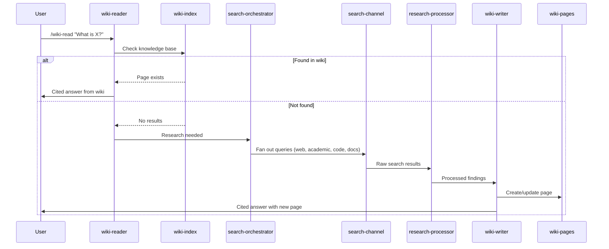
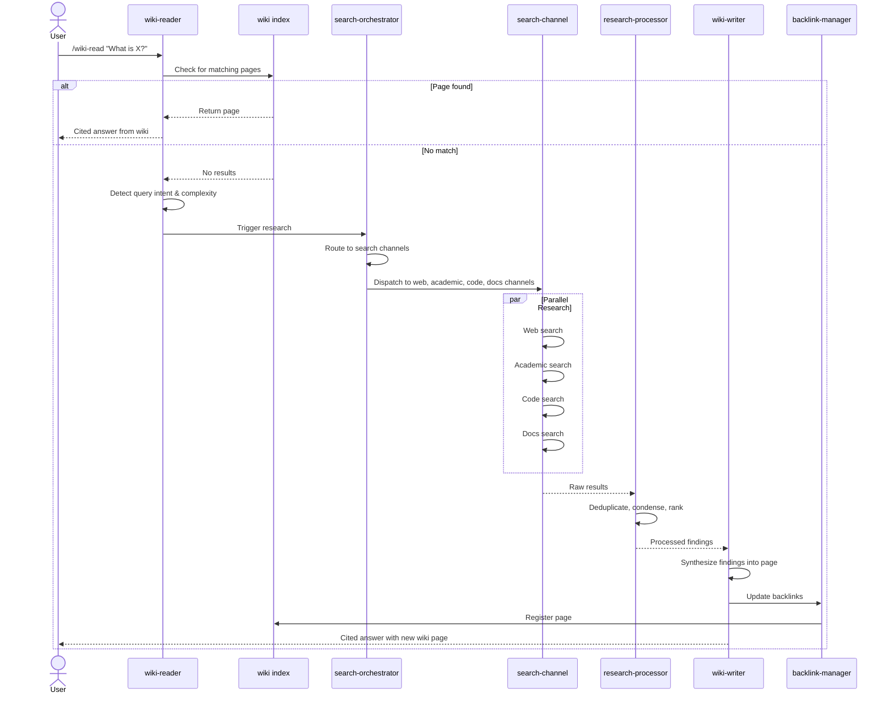
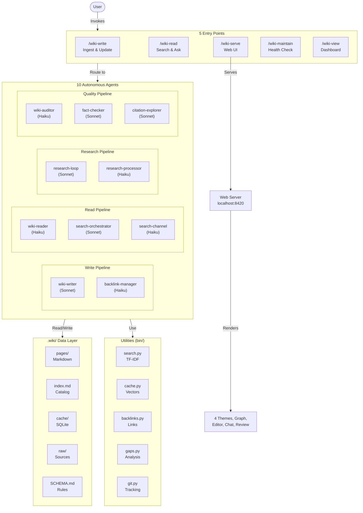
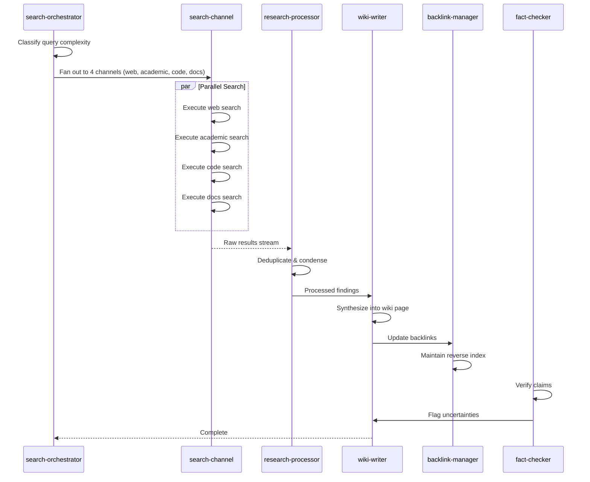
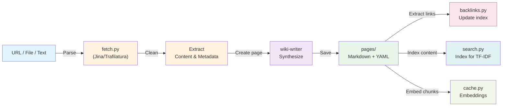
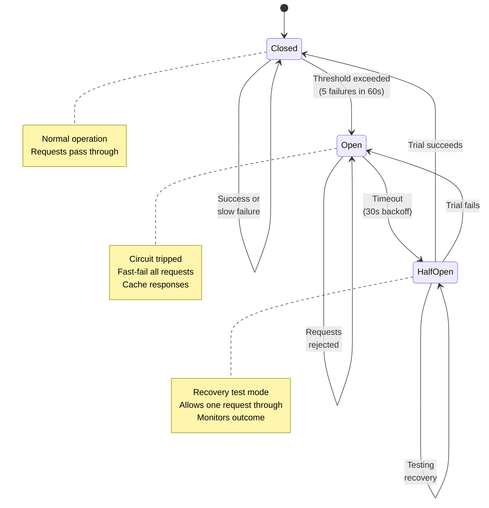

<p align="center">
  
  
  
  
</p>

# llm-wiki

**An autonomous knowledge base that grows as you work.**

LLM Wiki is a [Claude Code](https://claude.ai/claude-code) plugin that captures research, ideas, and decisions into an interlinked wiki with semantic search, automatic research, and a Wikipedia-style web UI. Knowledge compounds over time — the more you use it, the smarter it gets.

> Inspired by [Andrej Karpathy's LLM Wiki pattern](https://gist.github.com/karpathy/442a6bf555914893e9891c11519de94f): raw sources are immutable, the LLM maintains the wiki layer, and a schema governs behavior.


## Core Features

### Knowledge Management
- **Automatic capture** — saves research, ideas, decisions, and findings to the wiki as you work
- **Smart retrieval with research-on-miss** — checks wiki first, automatically researches and ingests if not found
- **Full-text search** — TF-IDF keyword search with content-aware scoring and snippet extraction
- **Block references & transclusion** — `[[page#heading]]` links and `![[page#section]]` embeds
- **Backlink panel** with automatic unlinked mention detection
- **Frontmatter query language** — Dataview-like queries: `SELECT title, type FROM pages WHERE confidence = "high"`
- **Intelligent freshness** — 9-tier staleness system from `live` (15 min) to `permanent` (never expires)

### Research-on-Miss
- **Automatic research** — `/wiki-read` researches topics not in the wiki using available tools
- **Tool discovery** — works with whatever tools the user has (WebSearch, WebFetch, Wikipedia API, MCP tools)
- **Auto-ingestion** — saves findings to wiki with proper citations

### Web UI Features
- **Wikipedia-style browsable website** with 4 themes (light, dark, terminal, wikipedia)
- **Interactive knowledge graph** ([Cytoscape.js](https://js.cytoscape.org/)) with multiple layouts, clustering, and neighborhood highlighting
- **Canvas/whiteboard view** for spatial page arrangement
- **Split-pane markdown editor** with live preview and AI assist
- **Live research** — click any red link to auto-research the topic
- **Spaced repetition** review interface ([FSRS](https://github.com/open-spaced-repetition/fsrs4anki)-based scheduling)
- **Content gap analysis** dashboard
- **WebSocket chat** sidebar with RAG-augmented Q&A

### Maintenance & Health
- **Self-maintaining** — lints broken links, merges duplicates, upgrades confidence, flags stale content
- **Daily notes** and journal workflows
- **Smart caching** with adaptive TTL and stale-while-revalidate
- **Circuit breakers** for external API resilience
- **Git integration** with auto-commit, attribution, and undo

## How It Works

The wiki operates in a simple cycle: when you ask a question, it first checks its knowledge base. If found, it returns a cited answer. If not found, it automatically researches the topic, ingests the findings, and provides an answer—all without breaking your workflow.



## Quick Start

### Installation

1. **Install the plugin**:
   ```bash
   claude plugin install ./llm-wiki
   ```
   Or copy manually:
   ```bash
   cp -r llm-wiki .claude/plugins/
   ```

2. **Restart Claude Code** — dependencies install automatically on first session.

### First Commands

Start using the wiki immediately with any of these:

| Command | Purpose |
|---------|---------|
| `/wiki-write https://example.com/article` | Ingest a web page |
| `/wiki-read "What is transformer attention?"` | Ask — researches if not in wiki |
| `/wiki-serve` | Browse the wiki at `localhost:8420` |
| `/wiki-maintain` | Health check and optimization |

### Dependencies

Core dependencies (fastapi, uvicorn, mcp, etc.) are installed automatically via the plugin's `SessionStart` hook. For optional enhanced features:
```bash
pip install trafilatura        # fallback content extraction
pip install numpy sqlite-vec   # vector search and caching
```

## Skills Reference

### `/wiki-write` — Add or Update Content

Ingest from URLs, files, or text. Auto-creates `.wiki/` on first use.

| Mode | Command | Purpose |
|------|---------|---------|
| Ingest | `/wiki-write <url>` | Fetch and ingest web page or paper |
| Ingest | `/wiki-write <file>` | Ingest local file (markdown, text, PDF) |
| Ingest | `/wiki-write "text..."` | Ingest inline text directly |
| Batch | `/wiki-write --batch <dir>` | Ingest all `.md` files in directory |
| Update | `/wiki-write --update <slug>` | Autonomously update existing page |
| Refresh | `/wiki-write --refresh-stale` | Find and refresh stale pages |

**Page types:** `concept`, `idea`, `brainstorming`, `status`, `rules`, `config`, `skill`, `memory`, `reference`, or custom types from `.wiki/templates/`

### `/wiki-read` — Search and Query

Ask the wiki questions. Automatically researches if knowledge is missing.

| Depth | Command | Behavior |
|-------|---------|----------|
| Quick | `/wiki-read quick <question>` | Index scan only, no research fallback (fastest) |
| Standard | `/wiki-read <question>` | Search wiki + auto-research if missing |
| Deep | `/wiki-read deep <question>` | Full search + raw sources + multi-channel research |

All answers include `[[slug]]` citations. Contradictions between sources are explicitly noted.

### `/wiki-serve` — Web UI

Launch Wikipedia-style browsable website at `localhost:8420`.

**Features:**
- 4 themes (light, dark, terminal, wikipedia)
- Interactive knowledge graph (Cytoscape.js)
- Split-pane markdown editor with live preview
- WebSocket chat with RAG-augmented Q&A
- Live research (click red links to auto-research)
- Spaced repetition review (FSRS-based)
- Content gap analysis dashboard
- Canvas/whiteboard spatial view

**Stop:** `/wiki-serve stop`

### `/wiki-maintain` — Health Maintenance

Comprehensive wiki maintenance and quality control.

| Subcommand | Purpose |
|------------|---------|
| `/wiki-maintain` | Run all maintenance steps |
| `/wiki-maintain lint` | Fix broken links, missing frontmatter, orphans |
| `/wiki-maintain dedup` | Find and merge near-duplicate pages |
| `/wiki-maintain gaps` | Analyze knowledge gaps and missing coverage |

**Maintenance steps:**
1. **Lint** — fix broken `[[links]]`, missing frontmatter, orphan pages
2. **Deduplicate** — merge pages with >60% slug token overlap
3. **Confidence upgrade** — promote pages based on source count (low->medium->high)
4. **Stale detection** — flag pages past their freshness tier TTL
5. **Fact-checking** — verify claims on high-confidence pages
6. **Concept synthesis** — auto-generate articles connecting 3+ related pages
7. **Index regeneration** — rebuild `index.md` from all pages

### `/wiki-view` — Dashboard and Export

Read-only dashboard, statistics, and export capabilities.

| Subcommand | Purpose |
|------------|---------|
| `/wiki-view` | Dashboard summary (page counts, recent activity, health) |
| `/wiki-view pages` | List all pages grouped by type |
| `/wiki-view stats` | Detailed statistics and distributions |
| `/wiki-view graph` | Knowledge graph visualization (Mermaid) |
| `/wiki-view graph <slug>` | Graph centered on page (2-hop neighborhood) |
| `/wiki-view export html` | Export as self-contained HTML |
| `/wiki-view export md` | Export as single markdown bundle |
| `/wiki-view export json` | Export as JSON knowledge graph |
| `/wiki-view artifacts <type>` | Generate study guide, timeline, glossary, or comparison |

---

## How Research-on-Miss Works

When you ask a question that's not in the wiki, the entire research pipeline activates automatically. Here's the flow:



---

## Architecture

### System Overview

LLM Wiki consists of 5 entry points (skills), 10 autonomous agents, utilities in the bin/, and a persistent data layer in .wiki/.



### Directory Structure

```
llm-wiki/
  .claude-plugin/              Plugin metadata (plugin.json, marketplace.json)
  agents/                      10 autonomous agents
  bin/                         23 CLI utilities (search, backlinks, gaps, cache, git, ...)
  mcp/                         MCP server for wiki operations
  rules/                       Workflow and integration rules
  skills/                      5 user-facing skills
    serve/                     Web UI server and assets
      scripts/                 FastAPI server, WikiStore, RAG, chat, research workers
      static/                  JavaScript + CSS (4 themes)
      templates/               16 Jinja2 templates
```

### Agent Collaboration During Research

When `/wiki-read deep` triggers a deep research operation, agents coordinate like this:



### Data Flow: From Source to Wiki

How content flows from raw sources into the wiki knowledge base:



---

### Circuit Breaker Resilience

External API calls are protected by circuit breakers that gracefully degrade when services fail:



---

## Data Model

Wiki data lives in `.wiki/` — its location is derived from the plugin install scope:
- **User-level install** (`~/.claude/plugins/llm-wiki`) -> `~/.wiki/`
- **Project-level install** (`.claude/plugins/llm-wiki`) -> `.wiki/` at project root

```
.wiki/
  pages/          Markdown files with YAML frontmatter (source of truth)
  templates/      Custom page type templates (user-defined structures)
  index.md        Auto-generated page catalog
  log.md          Append-only activity log
  overview.md     Current understanding synthesis
  SCHEMA.md       Page format and evaluation rules
  cache/          SQLite databases (search, vectors, backlinks, flashcards, provenance)
  raw/            Immutable source materials
    web/          Fetched web pages
    papers/       Downloaded PDFs
    notes/        User notes and transcripts
    code/         Code snippets and repos
```

### Frontmatter Schema

```yaml
---
title: "Page Title"
type: concept|entity|source|analysis|idea|status|rules|config|skill|memory
confidence: high|medium|low
sources: [source-slug-1, source-slug-2]
related: [related-slug-1, related-slug-2]
tags: [tag1, tag2]
freshness_tier: standard  # optional override
created: 2025-01-15
updated: 2025-01-15
---
```

### Freshness Tiers

The wiki uses a 9-tier staleness system to determine when content needs refresh. Choose the tier matching your content's shelf life.

| Tier | TTL | When to Use | Examples |
|------|-----|------------|----------|
| `live` | 15 min | Ultra-current data | stock prices, live scores, server status |
| `breaking` | 1-6 hours | Rapidly evolving topics | breaking news, incident updates |
| `current` | 1-3 days | Time-sensitive | news articles, current events |
| `fast` | 1-4 weeks | Quickly changing fields | AI/LLM/MCP, API changes, benchmarks |
| `moderate` | 1-3 months | Moderate change rate | software versions, frameworks |
| `standard` | 6 months | Evergreen with updates | general knowledge, how-to guides (default) |
| `academic` | 1 year | Stable research | research papers, studies |
| `evergreen` | 5 years | Slowly changing | history, biographies, theorems |
| `permanent` | never | Immutable | personal notes, ideas, memories |

## Web UI

Start with `/wiki-serve` — opens at `localhost:8420`:

### Navigation & Discovery
- **Home** — recent pages, quick stats, search bar, active research tasks
- **Search** — TF-IDF full-text search with snippets and autocomplete
- **Knowledge graph** — interactive Cytoscape.js visualization with force-directed layouts, clustering, filtering
- **Canvas** — spatial whiteboard for arranging pages visually
- **Backlinks sidebar** — reverse links and unlinked mention detection

### Content Creation & Editing
- **Page view** — rendered markdown with source annotations, red-link detection, live research
- **Editor** — split-pane markdown + live preview with formatting toolbar and AI assist
- **Templates** — custom page type templates with auto-fill

### Learning & Review
- **Review** — FSRS-based spaced repetition flashcard interface for active recall
- **Research dashboard** — background research task queue with SSE progress streaming
- **Chat sidebar** — WebSocket-based RAG-augmented Q&A with cited answers

### Analysis & Insights
- **Stats** — page counts, type/confidence distributions, freshness overview
- **Gaps** — content gap analysis: missing pages, depth gaps, freshness gaps, structural holes
- **Themes** — 4 visual themes (light, dark, terminal, wikipedia)

### Custom Page Types

Create templates in `.wiki/templates/<type-name>.md`:

```yaml
---
title: "{{title}}"
type: meeting-notes
confidence: medium
attendees: []
date: "{{date}}"
created: "{{created}}"
updated: "{{updated}}"
---

# {{title}}

## Attendees

## Discussion

## Action Items
```

Use with `/wiki-write` — the wiki-writer agent automatically applies templates based on the `type:` field.

## Agents

| Agent | Model | Purpose |
|-------|-------|---------|
| `wiki-writer` | Sonnet | Create/update pages — autonomous ingest and update |
| `wiki-reader` | Haiku | Search wiki, synthesize cited answers, research on miss |
| `wiki-auditor` | Haiku | Lint, dedup, fix broken links, upgrade confidence |
| `backlink-manager` | Haiku | Maintain reverse index, update related fields, detect unlinked mentions |
| `search-orchestrator` | Sonnet | Classify complexity, fan out to channels, rank results |
| `search-channel` | Haiku | Execute searches per channel (web, academic, code, docs) |
| `research-loop` | Sonnet | Iterative research with git-based rollback (max 3 iterations) |
| `research-processor` | Haiku | Condense and deduplicate parallel research results |
| `fact-checker` | Sonnet | Verify claims against external sources |
| `citation-explorer` | Sonnet | Academic citation graph snowballing |

## MCP Tools

The plugin includes an MCP server exposing wiki operations:

| Tool | Description |
|------|-------------|
| `wiki_search` | TF-IDF full-text search |
| `wiki_read` | Read a page by slug |
| `wiki_write` | Create or update a page |
| `wiki_list` | List pages, optionally filtered by type |
| `wiki_backlinks` | Get backlinks + unlinked mentions |
| `wiki_stats` | Page count, type/confidence distributions |
| `wiki_query` | Dataview-style frontmatter queries |
| `wiki_gaps` | Content gap analysis |
| `wiki_daily` | Create/get today's daily note |
| `wiki_wikipedia_search` | Search Wikipedia via MediaWiki Action API |

## Compatibility

- **Obsidian** — open `.wiki/` as a vault for graph visualization and editing
- **Any MCP tools** — the wiki discovers available tools at runtime (Perplexity, Context7, etc.)
- **Git** — wiki changes are tracked, with auto-commit and rollback support

## Credits

- [Andrej Karpathy's LLM Wiki gist](https://gist.github.com/karpathy/442a6bf555914893e9891c11519de94f) — the original pattern
- [FSRS](https://github.com/open-spaced-repetition/fsrs4anki) — spaced repetition scheduling algorithm
- [Cytoscape.js](https://js.cytoscape.org/) — knowledge graph visualization
- [FastMCP](https://github.com/jlowin/fastmcp) — MCP server framework
- [FastAPI](https://fastapi.tiangolo.com/) — web server framework
- [markdown-it](https://github.com/markdown-it/markdown-it) — markdown rendering

## Rules (Always-On Behavior)

The plugin includes two always-active rule files that govern behavior:

### Write Rules (`rules/wiki-integration.md`)

**Write to the wiki when:**
- You research any topic — save findings as a wiki page
- You generate analysis, comparisons, or summaries worth keeping  
- You solve non-trivial problems — save the solution pattern
- The user shares ideas, plans, decisions, or requirements
- You discover facts, relationships, or patterns during work
- The user says "save this", "remember this", "note this"

**Read from the wiki when:**
- The user asks about a topic — check wiki FIRST before web search
- You need context about the project, its decisions, or history
- You're about to research something — check if wiki already covers it

### Workflow Rules (`rules/workflow.md`)

- **Ingest is autonomous** — never pause for user confirmation
- **Contradictions are flagged** — note both views, never silently overwrite
- **Backlinks are mandatory** — update `related:` fields on connected pages
- **Complete frontmatter required** — every page needs title, type, confidence, created, updated
- **Auto-init** — create `.wiki/` automatically if it doesn't exist
- **Freshness-aware** — 9-tier staleness system governs when content needs refresh

## Troubleshooting

| Issue | Solution |
|-------|----------|
| No wiki found | Run any `/wiki-*` command — `.wiki/` auto-creates |
| Web UI won't start | Check port 8420 availability; run `/wiki-serve stop` then retry |
| Search returns no results | Run `/wiki-maintain` to rebuild indexes |
| Broken links | Run `/wiki-maintain lint` to auto-fix |
| Stale content | Run `/wiki-write --refresh-stale` to update old pages |

## License

MIT
